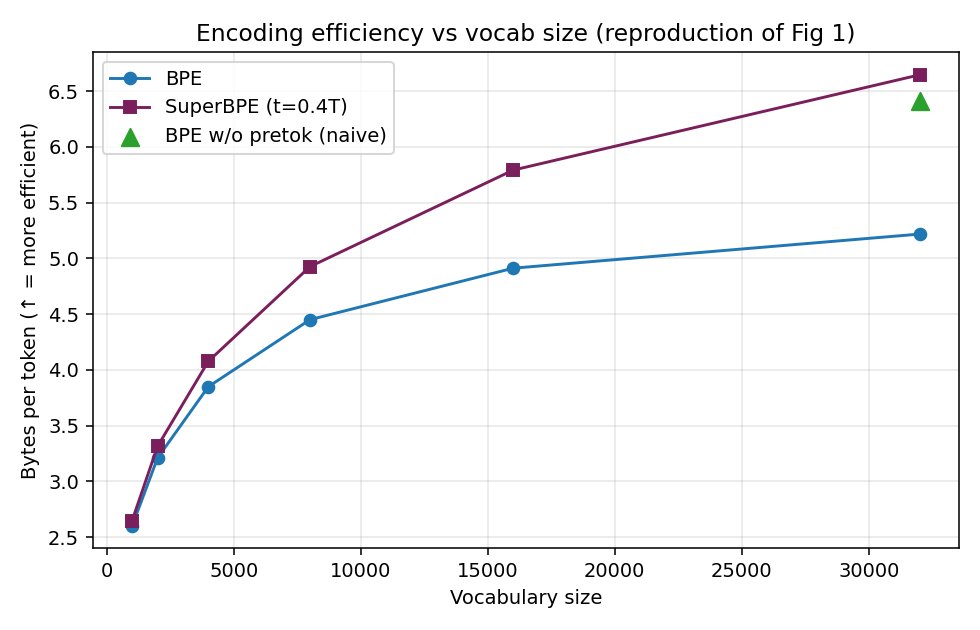

# SuperBPE Reproduction

A from-scratch, $0 reproduction of **SuperBPE: Space Travel for Language Models**
(Liu et al., COLM 2025 — [arXiv:2503.13423](https://arxiv.org/abs/2503.13423)) on a laptop, no GPU.

SuperBPE is ordinary byte-level BPE split into two phases by a transition point `t`: phase 1 learns
normal subwords (merges can't cross whitespace); phase 2 lifts that rule so tokens can span spaces,
producing multi-word **"superwords"** (`▁of▁course`, `▁by▁the▁way`). The result: the same text needs
fewer tokens.

This repo reimplements the trainer from scratch (`src/bpe.py`) and reproduces the **tokenizer-level
encoding-efficiency claims** at small scale. The 8B downstream/MMLU results are explicitly out of
scope — they're not measurable on a laptop, and this repo never claims them.

## Result

| Claim (paper) | Reproduced? |
|---|---|
| C2 — BPE encoding efficiency **plateaus** with vocab | ✅ shape |
| C3 — SuperBPE **keeps rising**, overtakes BPE | ✅ shape |
| C4 — efficiency is smooth in `t` with an **interior optimum** | ✅ |
| C6 — naive no-pretok BPE is **worse** than SuperBPE | ✅ |
| C1 — up to 33% fewer tokens @200k vocab | 🟡 direction only (scale-limited) |
| C5, C7–C8, C10–C12 — exact 200k/8B numbers, MMLU | ⬜ out of scope at this scale |

Full per-claim verdicts and the semantic diff against the official code:
**[`REPRO_REPORT.md`](REPRO_REPORT.md)**.



Measured on a 10 MB cosmopedia-v2 corpus + held-out shard, CPU only. Absolute bytes/token differ
from the paper's (10 GB corpus, 200k vocab) **by design** — the target is the mechanism and the
direction, not the numbers (see [`ASSUMPTIONS.md`](ASSUMPTIONS.md)).

## Run it

```bash
python src/fetch_corpus.py        # download the small corpus into data/
python src/verify_toy.py          # M1 gate: confirms superwords form (and don't, for plain BPE)
python src/sweep_efficiency.py    # vocab sweep (1k–32k) + transition-point sweep -> runs/
python src/plot_efficiency.py     # regenerate runs/fig1, fig2
```

A presentable walkthrough deck is in [`slides.html`](slides.html) (中文: [`slides-zh.html`](slides-zh.html)).

## Layout

```
superbpe-reproduction/
  src/              from-scratch two-phase BPE (bpe.py) + sweep/plot/verify scripts
  paper/            source PDF pointer + reproduced figure
  runs/             sweep results (json) and plots (png)
  CLAIMS.md         every claim, exact paper numbers, target-marked
  ASSUMPTIONS.md    every gap the paper leaves + the choice made and why
  METHODOLOGY.md    milestones + the pass/fail gate defined for each
  REPRO_REPORT.md   per-claim verdicts + semantic diff vs official code
```

## References

- **Paper**: SuperBPE: Space Travel for Language Models — [arXiv:2503.13423](https://arxiv.org/abs/2503.13423)
- **Official code**: https://github.com/PythonNut/superbpe
- **Released tokenizers**: https://huggingface.co/collections/UW/superbpe-67db2338062faa07c7473ffa
